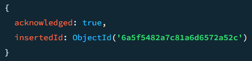

# Open Shell Commands

- use Madhur_test

show - 

- show dbs;
  - all dbs prints
- show collections
      - all collection on Madhur_Test
- db.Product.insertOne({
  ProductName:"asus",
  CategoryName:"laptop",
  price:92000
})

 